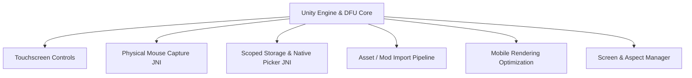

# Daggerfall Unity Android Port — Technical Overview

This file provides a comprehensive architectural and code-level overview of the **Unofficial Android Port of Daggerfall Unity (DFU)**. It is designed to help developers and AI agents quickly understand the custom systems, integrations, and optimizations implemented for the mobile version of the game.

---

## 📌 Architecture & Core Systems

Unlike the desktop version of Daggerfall Unity, the Android port must handle mobile-specific challenges such as touch overlays, scoped storage permissions, physical mouse/keyboard capture, game data/mod importing from archives, and mobile hardware constraints. 

The core custom systems are divided into the following key modules:

---

### 1. Touchscreen Controls (`Assets/Android/`)
The port implements a fully custom, highly configurable touch control overlay that sits on top of the Unity UI.
* **Layout Management (`TouchscreenLayoutsManager.cs`)**:
  - Manages, loads, and saves touchscreen button profiles (JSON-based configuration files saved in the user's persistent data path under `TouchscreenLayouts/`).
  - Supports importing and exporting layouts as zipped packages via a native file picker.
  - Provides a UI edit mode to add, delete, resize, reposition, and customize button bindings, sensitivities, and icons.
* **On-Screen Controllers**:
  - **`TouchscreenButton.cs`**: Logic for individual buttons, including action mapping (mapping buttons to custom DFU actions or keyboard keys), sizing, anchoring, parent-child drawer buttons (`TouchscreenButtonType.Drawer`), and texture customization.
  - **`VirtualJoystick.cs` & `StaticTouchscreenJoystickOrDPad.cs`**: Handles virtual dual-stick inputs for player movement and looking.
  - **`TouchscreenInputManager.cs`**: Intermediary manager coordinating touch events with DFU's standard `InputManager`.

---

### 2. Physical Mouse & 360-Degree Look
To support Chromebooks, tablets, or phones with connected mice/keyboards, the port features a custom JNI pointer capture system.
* **Android Library (`android-input-capture.aar` / `Plugins/Android/`)**:
  - A native Android archive that hooks into Android's low-level `MotionEvent` to capture mouse cursor events raw, bypassing screen edge constraints.
* **JNI Bridge & Native Interface (`PointerCaptureNativeInterface.cs`)**:
  - Invokes compiled Java methods in `com.example.androidinputcapture.PointerCaptureHelper` to start/stop raw pointer capture, retrieve relative mouse delta values, scroll steps, and raw button click states.
* **Pointer Capture Manager (`PointerCaptureManager.cs`)**:
  - Synchronizes cursor lock status (`Cursor.lockState == CursorLockMode.Locked`) with Android pointer capture.
  - Maps Android raw `MotionEvent` buttons to Unity's mouse buttons (0 to 6).
* **Input Facade (`CapturedInput.cs`)**:
  - Acts as a drop-in replacement facade for standard Unity `Input` API methods (e.g., `GetMouseButtonDown`, `GetAxis("Mouse X")`, `mouseScrollDelta`).
  - When pointer capture is active, it routes calls to use the JNI-captured mouse data. When inactive, it falls back to the default Unity touch/input behaviors.

---

### 3. Scoped Storage & Native Directory Selection
To satisfy modern Android security models (scoped storage), the app uses JNI code to access directories outside its private sandbox.
* **Native Helper (`FolderPicker.java` / `Plugins/Android/`)**:
  - Spawns an Android `ResultFragment` using the `ACTION_OPEN_DOCUMENT_TREE` intent, allowing the user to select directory trees.
  - Resolves selected URIs into direct filesystem paths (`getPathFromTreeUri`) that can be read by standard C# directory APIs.
* **Android Utils (`AndroidUtils.cs`)**:
  - Checks and requests All Files Access (`MANAGE_EXTERNAL_STORAGE`) permissions on Android 11+ (API 30+) using `ACTION_MANAGE_APP_ALL_FILES_ACCESS_PERMISSION`.
  - Determines if a chosen path requires All Files Access (any folder outside the private `Application.persistentDataPath` requires it).
  - Handles programmatic app restarts (`RestartAndroid()`) for loading new files.

---

### 4. Game Data & Mod Import Pipelines
Android users typically cannot easily drag-and-drop game files or mods. The port automates this process through custom in-game import windows.
* **Game Data Importer (`FolderBrowserAndroid.cs`)**:
  - Prompts the user to pick a Daggerfall game data `.zip` file via a native file picker.
  - Unzips files asynchronously using Unity coroutines, showing progress status.
  - Automatically searches for a valid `arena2` folder (case-insensitively).
  - **Automatic `PACKED.DAT` Unpacker**: If the distribution contains compressed `PACKED.DAT` files, the utility automatically invokes `PackedDatFileUtils.cs` to extract them on the fly.
* **Mod Importer (`ModLoaderInterfaceWindow.cs` & `Unzip.cs`)**:
  - Implements mod importing with a visual progress bar.
  - **Android Mod Validation**: Inspects `.dfmod` / `.zip` files before copying them to ensure they contain an Android-compatible AssetBundle. If the mod is compiled only for PC/Mac/Linux, it rejects the import and guides the user.
  - **Loose StreamingAssets Support**: Scans zip archives for loose streaming assets (e.g., sound replacements, books, textures) and copies them to the respective subfolders inside the `StreamingAssets` directory.
  - Prompts for a game restart via `AndroidUtils.RestartAndroid()` upon upgrading mods.

---

### 5. Mobile Performance Optimization (`CulledGameObjectManager.cs`)
Mobile CPUs/GPUs have strict performance budgets. The port implements a custom incremental culling system to keep draw calls low.
* **Culling Loop**:
  - Loops over a 12-frame iteration cycle, dividing the culling workload of various object types across frames to prevent micro-stutters.
  - Tracks player position and culls distant objects outside `ScaledBlockRange` (a squared distance check).
* **Object Types Culled**:
  - Billboards (cull radius `150 * 150`), Foe Spawners, Enemies, Action Doors, Static NPCs, and Loot containers.
* **Culling Mechanics**:
  - Rather than disabling the game objects completely (which can break internal scripting or trigger CPU spikes), it reparents culled objects to a hidden parent (`culledObjectsParent` with `SetActive(false)`).
  - For Dungeon Blocks, it disables the mesh renderers of child "Models" and "Action Models" hierarchies while keeping script components active.

---

### 6. Display & Orientation Management (`AndroidScreenManager.cs`)
* **AScreen**: A custom helper class providing unified platform-independent width and height properties.
* **Screen Manager**:
  - Monitors screen size and orientation switches.
  - Clears aspect ratios on all active cameras (`cam.ResetAspect()`) and recreates UI render textures to prevent layout stretching.
  - Controls orientation presets (Portrait vs. Landscape constraints).

---

## 📂 Key Code & Asset Locations

Here is a map of the important directories and files added or modified for the Android port:

| Path | Purpose |
| :--- | :--- |
| **`Assets/Android/Scripts/`** | Core Android C# scripts (touch controls, culling, screen, upgrade configurations). |
| **`Assets/Android/Prefabs/`** | Pre-built UI overlays (`TouchscreenControlsManager`, `TouchscreenKeyboardManager`). |
| **`Assets/Android/Textures/`** | Texture overrides and icons for virtual buttons. |
| **`Assets/Android/OpenPointerCapture/`** | Sub-system handling native physical mouse captures. |
| [FolderPicker.java](file:///var/home/birger/repo/daggerfall-unity-android/Assets/Plugins/Android/FolderPicker.java) | Native Java directory selector tree resolver. |
| [Paths.cs](file:///var/home/birger/repo/daggerfall-unity-android/Assets/Scripts/Paths.cs) | Custom data path logic; handles APK assets extraction using `FastZip`. |
| [DaggerfallUnityApplication.cs](file:///var/home/birger/repo/daggerfall-unity-android/Assets/Scripts/DaggerfallUnityApplication.cs) | Overrides DFU data path with Android custom folder overrides. |
| [FolderBrowserAndroid.cs](file:///var/home/birger/repo/daggerfall-unity-android/Assets/Scripts/Game/UserInterface/FolderBrowserAndroid.cs) | Game data zip import manager, unzipper, and `PACKED.DAT` extractor. |
| [ModLoaderInterfaceWindow.cs](file:///var/home/birger/repo/daggerfall-unity-android/Assets/Game/Addons/ModSupport/ModLoaderInterfaceWindow.cs) | Mod import interface with platform compatibility checks and loose assets extraction. |
| [CulledGameObjectManager.cs](file:///var/home/birger/repo/daggerfall-unity-android/Assets/Android/Scripts/CulledGameObjectManager.cs) | Distant object rendering culler for mobile optimization. |

---

## 🛠 Development Notes & Workflows

### Target Platform Upgrade
The Unity project has been upgraded to **LTS Unity 2022.3.62f3** in the latest commits. When editing/building, ensure you use this version to avoid assembly discrepancies or asset bundle import errors.

### Mod Compatibility Tip
If a mod fails to load or shows incorrect behavior on Android, ensure it has been built using the Android target platform inside the Unity editor's Mod Builder window. Desktop asset bundles will be rejected during import in `ModLoaderInterfaceWindow.cs` via `IsLoadableModFile()` which validates the bundle layout.
